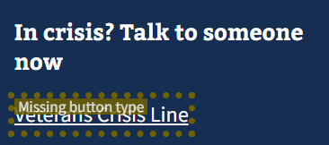
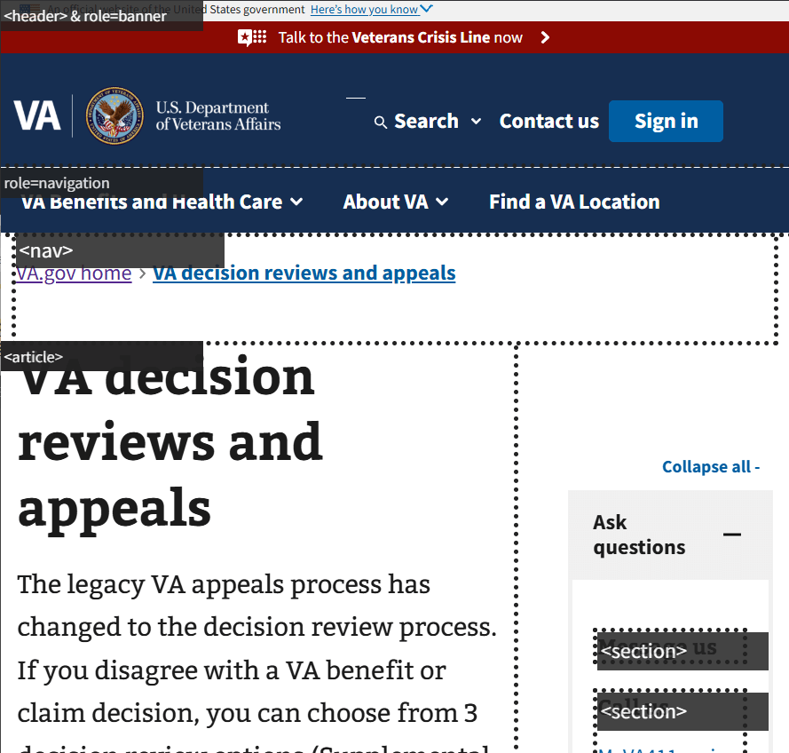

# VA page checker

> Highlight web components, accessibility issues, and other issues on VA.gov pages

Note: This extension works on all VA.gov subdomain pages (including dev & staging), locally, and in review instances.

## Features

Highlights

Hover over the highlighted outline to reveal the component underneath

VA design system web components

<!-- -->

- (green highlights) USWDS v3 components
- (dark red highlights) USWDS v1 components 

Elements that <em>should</em> be web components

<!-- -->

(dark red highlights)

- Div modal -> `va-modal`
- Plain button -> `va-button`
- Plain checkbox -> `va-checkbox`
- Plain number input -> `va-number-input`
- Plain radio input -> `va-radio-option`
- Plain search input -> `va-search-input`
- Plain select -> `va-select`
- Plain telephone link -> `va-telephone`
- Plain text input -> `va-text-input`
- Plain textarea -> `va-textarea`

Accessibility issues

<!-- -->

(gold highlights)

These rules were copied from [Smashing magazine "Apps For All" by Heydon Pickering](https://www.smashingmagazine.com/ebooks/apps-for-all-coding-accessible-web-applications/):

- buttons missing a `type`
- disabled elements
- links (`a`) missing an `href`
- links (`a`) that are empty and missing an `aria-label` and `aria-labelledby`
- buttons that are empty and missing an `aria-label` and `aria-labelledby`
- images missing `alt` content
- sections nested within sections
- elements with a `role="status"` without an `aria-live="polite"`
- elements with a `role="alert"` without an `aria-live="assertive"`
- elements with a `aria-live="polite"` without a `role="status"`
- elements with a `aria-live="assertive"` without a `role="alert"`

Custom rules:

- links (`a`) with `target="_blank"` missing `rel="noreferrer noopener"`
- links (`a`) going outside of VA.gov domain missing `rel="noreferrer noopener"`
- Any element with `aria-hidden="true"` that isn't an image, svg or empty
- Elements that contain an `sr-only` (screen reader only text)

DataDog privacy settings

	

(purple highlights)

- hidden privacy class or data-attribute
- masked privacy class or data-attribute
- action name data-attribute for hidden setting
- action name data-attribute for masked setting

Landmarks

<!-- -->

(Dark gray highlights)

The following landmarks are highlighted:

- `form` with & without `role="form"`
- `header` with & without `role="banner"`
- `main` with & without `role="main"`
- `nav` with & without `role="navigation"`
- `search` with & without `role="search"`
- `section` with & without `role="region"`
- `article` with role that is not `role="article"`
- `aside` with role that is not `role="complementary"`
- `footer` with role that is not `role="contentinfo"`
- `role="application"`

- `role="article"` that is not an article
- `role="complementary"` that is not an aside
- `role="form"` this is not a `form`
- `role="banner"` this is not a `header`
- `role="main"` this is not a `main`
- `role="navigation"` this is not a `nav`
- `role="search"` this is not a `search`
- `role="region"` this is not a `section`
- `role="article"` with role this is not an `article`
- `role="complementary"` with role this is not an `aside`
- `role="contentinfo"` with role this is not a `footer`

Other

<!-- -->

(Orange highlight)

The following elements are highlighted:

- `role="alert"`
- `role="log"`
- `role="marquee"`
- `role="status"`
- `role="timer"`
- `role="presentation"`
- `role="none"`

### Install

### Run locally

1. Download the zip or clone the repo `git clone https://github.com/Mottie/va-page-checker`
2. Open browser's extension page `chrome://extension` for Chrome, or `edge://extensions` for Edge
3. Enable "Developer mode"
4. Use "Load unpacked" button
5. Target the `va-page-checker` folder
6. Pin the "VA page checker" icon and toggle the button to highlight content

## License

This browser extension is released under [CC0](#license).

